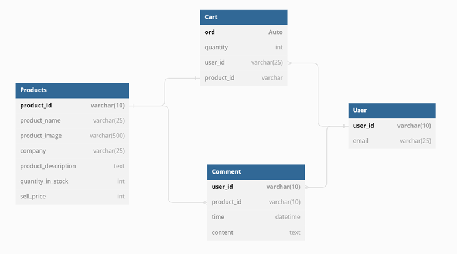

# Website selling clothes
## Describe
- This is a website that sells clothes
Coded in python language and using django framework.
## Group member information 
|Id|Full name|Student ID|
|-|-|-|
|1|Lê Tôn Nhân|19520199|
## Environment settings
- Open tempinal on vscode
- Execute the command `python -m venv venv`
- Execute file: /venv/Scripts/activate.bat to enter the environment
- Install some required packages to use django:
     - pip install -U wheel
     - pip install django
## Commands needed to create the project
- Create a new project
> django-admin startproject MyProject
- Create a new app
> python manage.py startapp MainApp
- Check changes in cached database
> python manage.py makemigrations
- Save database
> python manage.py migrate
- Run server
> python manage.py runserver
- Install superuser (admin/admin)
> python manage.py createsuperuser
## Some extra packages
> pip install icecream
> pip install django-ckeditor
> pip install django-mathfilters

## Describe
- This is a website that sells clothes
### User admin to manage:
- Username: admin
- Password: admin
### Regular User:
- Username: nhalee
- Pass: Nhanle1234@

## Function

- Login, register: Perform escape of inputs, for username use regex to check including only characters from a-z, A-Z, 0-9, check email is valid or not use function validate_email powered by django
- User authorization (supported by django): Admin will have the right to delete products, delete users ..., and users only have the right to view and order products
- Search for 1 product: Search for products by product name
- Comment 1 product: Use csrf_token supported by django to avoid csrf attack

## Cấu trúc CSDL

### Link demo: https://webshopping1.herokuapp.com/

