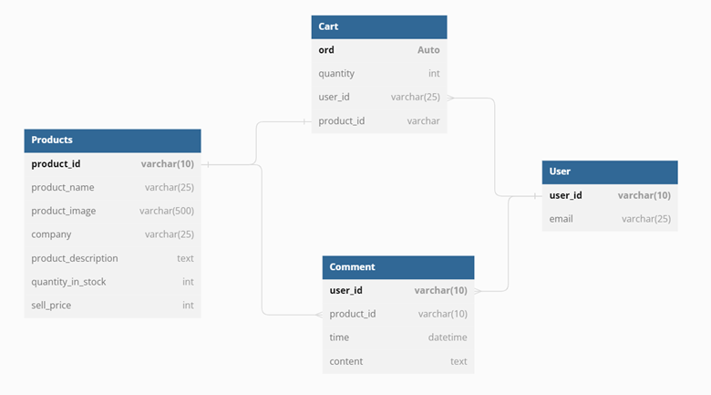

# Website bán quần áo
## Cài đặt môi trường
- Mở teminal trên vscode
- Thực hiện lệnh `python -m venv venv` 
- Thực thi file: /venv/Scripts/activate.bat để vào môi trường
- Cài đặt một số gói yêu cầu để sử dụng django:
    - pip install -U wheel 
    - pip install django 
## Các lệnh cần thiết để tạo project 
- Tạo 1 project mới
> django-admin startproject MyProject
- Tạo 1 app mới
> python manage.py startapp MainApp
- Kiểm tra thay đổi trong cơ sở dữ liệu lưu vào bộ nhớ tạm
> python manage.py makemigrations
- Lưu database
> python manage.py migrate
- Run server
> python manage.py runserver
- Cài đặt superuser (admin/admin)
> python manage.py createsuperuser 
## Một số gói cài thêm 
> pip install icecream
> pip install django-ckeditor
> pip install django-mathfilters

## Mô tả
- Đây là một web bán quần áo
### User admin để quản lý:
- Username: admin
- Pass: admin
### User thông thường:
- Username: nhanlee
- Pass: Nhanle1234@

## Chúc năng

o	Đăng nhập, đăng ký
•	Thực hiện escape các đầu vào, đối với username sử dụng regex để kiểm tra chỉ bao gồm các ký tự từ a-z, A-Z, 0-9, kiểm tra email có hợp lệ không sử dụng function validate_email được hỗ trợ bởi django
o	Phân quyền user (hỗ trợ bởi django)
•	Admin sẽ có quyền xóa sản phẩm, xóa user ..., còn user chỉ có quyền xem và đặt hàng sản phầm
o	Tìm kiếm 1 sản phẩm
•	Tìm kiếm sản phẩm theo tên sản phẩm
o	Bình luận 1 sản phẩm
•	Sử dụng csrf_token được hỗ trợ bởi django để tránh csrf attack

## Cấu trúc CSDL

### Link demo: https://webshopping1.herokuapp.com/

